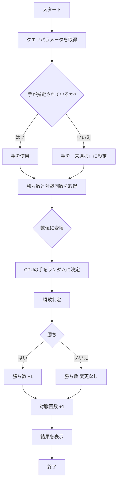
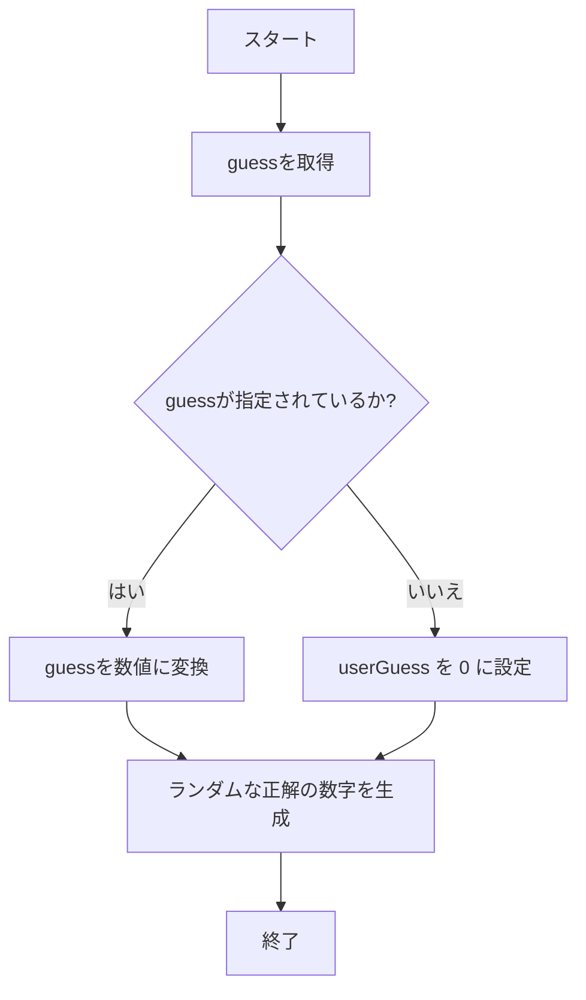
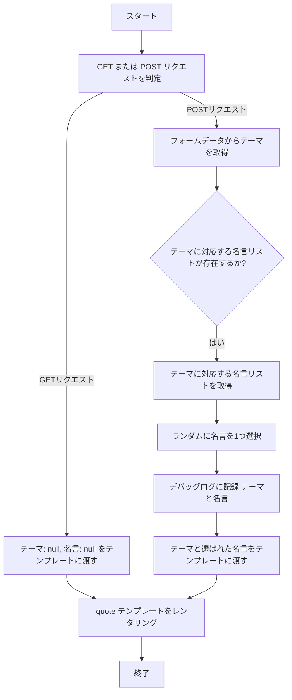

# webpro_06

##　このプログラムについて

##　ファイル一覧
ファイル名 | 説明
-|-
app5.js | プログラム本体
public/janken.html | じゃんけんの開始画面
views/guess.ejs | 数字一発当てゲーム開始画面
views/quote.ejs | 名言表示画面
## じゃんけん
### ファイルの起動方法
1. app5.js を起動する
1. Webブラウザでlocalhost:8080/public/janken.htmlにアクセスする
1. 指示に従い入力する
### プログラムの内容
```javascript
let hand = req.query.hand || "未選択";
```
で,ユーザーの入力を受け取る.
```javascript
const num = Math.floor(Math.random() * 3 + 1);
```
で,CPUの出す手をランダムに決める.
```javascript
if (num === 1) cpu = "グー"; else if (num === 2) cpu = "チョキ"; else cpu = "パー";
```
で,生成したnumの値に応じて,CPUの出す手を決定する.
```javascript
let judgement = "勝ち";
```
で,勝敗を判定する.
### フローチャート


##　数字一発当て
### ファイルの起動方法
1. app5.js を起動する
1. Webブラウザでlocalhost:8080/guessにアクセスする
1. 数字を入力する
### プログラムの内容
```javascript
const userGuess = Number(req.query.guess || 0);
```
で,ユーザーが入力した値を受け取る.
```javascript
const correctNumber = Math.floor(Math.random() * 100) + 1;
```
で,ランダムな数値を出力する.
### フローチャート


##　名言表示
### ファイルの起動方法
1. app5.js を起動する
1. Webブラウザでlocalhost:8080/quoiteにアクセスする
1. 見たいものをクリックする
### プログラムの内容
```javascript
const themeQuotes = quotes[theme];
```
で,事前に定義されていたテーマ別の名言データを取得する.
```javascript
Math.random
```
で,リスト内の名言を一つ選択する.　
```javascript
res.render("quote", { theme, quote });
```
テーマと選ばれた名言をテンプレートに渡す.
### フローチャート


